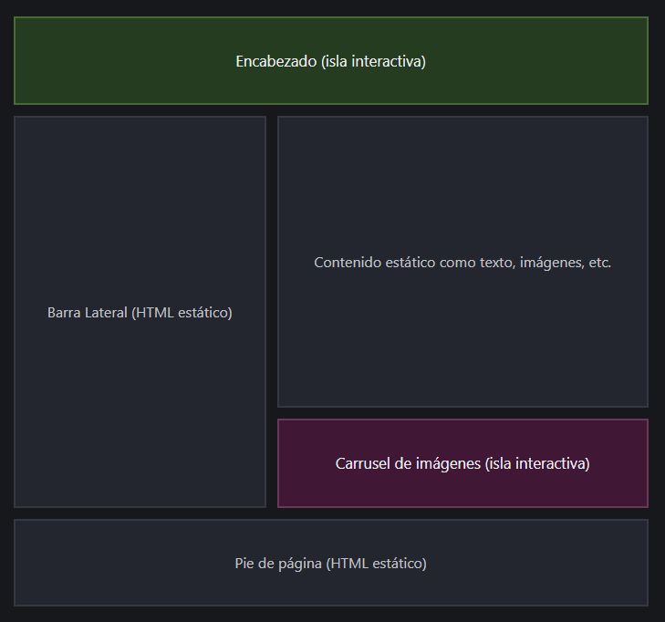
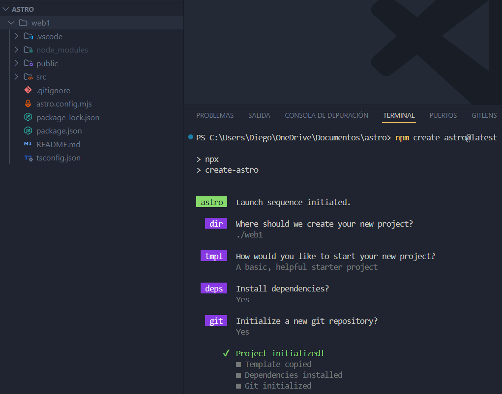

# ASTRO

## CONCEPTOS

- Astro usa una **arquitectura de islas**. Se basa en componentes UI
que se catalogan con islas interactivas (HTML+JS+CSS) y islas estáticas (HTML+CSS)

## INSTALAR Y CONFIGURAR ASTRO

- Requisitos: Visual Studio, Node JS (v18-v20) y Terminal

1. `npm create astro@latest`
   
2. https://www.youtube.com/watch?v=YRQzhUMwXD4
