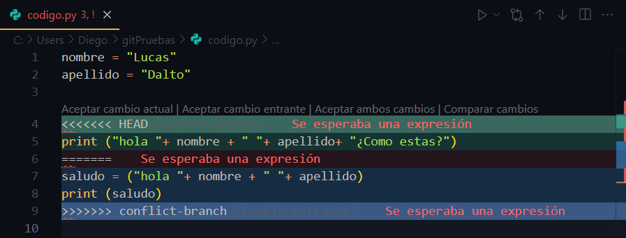

# GIT

Terminar y dejar bien este md

## ÁREAS DE TRABAJO

| ÁREAS DE TRABAJO | DEFINCIÓN |
| --- | --- |
| `Espacio de trabajo` | Carpeta donde se guardan todos los archivos y donde con Visual Studio se modifica esos archivos |
| `Área de preparación` | Área entre el espacio de trabajo y el repositorio, aquí se descartan o confirman los `commit`. |
| `Repositorio` | Almacén de archivos tras un `commit`. Se organizan en `commits`. |

- `Commit` → Es hacer un punto de guardado en un punto específico.
- `Ramas (branches)` → Ramas secundarias que nacen del `main` (Rama principal)

## CONFIGURACIÓN DE GIT

- `git config —global user.name “Nombre”` → Configura un nombre.
- `git config —global user.email` `“correo”` → Configura un correo.
- `git config —global core.editor “code —wait”` → Asigna a VS para los reportes.
- `git config —global init.defaultBranch` `main` → Cambiamos a `main.`
- `git config —global color.ui` `true` → Añade colores a la intefaz.
- `git config —list` → Muestra la configuración de `Git.`
- `git config —global core.abbrev` (`Número`) → El número de caracteres en `git --oneline`.

## COMANDOS INICIALES

`GIT`

- `git` → Muestra los diferentes parámetros que tiene G`it`.
- `git` —`versión` → Muestra le versión de git instalada.
- `git help (comando) →` Explica como funciona un comando.

    ---

`UBICACIÓN`

- `pwd` → Nos muestra donde estamos.
- `cd` (`Nombre Carpeta`) → Entra en la carpeta.
- `cd` .. → Volver atrás.

---

`MANIPULACIÓN`

- `touch` (`NombreArchivo`) → Crea un archivo de cualquier extensión.
- `mkdir` (`NombreCarpeta`) → Crear carpeta.
- `rmdir` (`NombreCarpeta`) → Borrar carpeta.
- `ls` → Muestra los archivos de la carpeta.
- `ls -a` → Muestra los archivos ocultos.

---

- `clear` → Limpia la interfaz de Git Bash.

## INIT, ADD, COMMIT

### INICIO DE GIT (INIT)

- `git init` → Iniciamos git en esa carpeta.

### ADD

- `git add` `(nombre-archivo` → Añade el archivo al área de preparación.

---

- `git status -s` → Muestra el área de preparación:
  - Aquellos que no han sido registrados por git (`??`)
  - Aquellos que están en el área de preparación y van a ser subidos por primera vez (`A`)
  - Modificados y no subidos al área de preparación (`M`)
  - Modificados y subidos al área de preparación (`M`)
  - Modificados en el área de preparación (`MM`)

### COMMIT

- `git commit -m` “`Mensaje`” → Traslada los archivos del área de preparación al repositorio.
- `git commit` → Traslada los archivos del área de preparación al repositorio y abre Visual Studio para que puedas añadir el mensaje.

---

- `git commit —amend` → Permite modificar el mensaje del último commit.

---

- `git log —oneline`→ Muestra los commits realizados.

## GIT DIFF, SHOW, TAG

### GIT DIFF

| `Comando` | `lo que hay en:` | `con lo que hay en:` |
| --- | --- | --- |
| `git diff` | Área de preparación (o HEAD) | Directorio de trabajo |
| `git diff`  `HEAD` | Último commit (HEAD) | Directorio de trabajo |
| `git diff` `identificador` | Commit `identificador` | Directorio de trabajo |
| `git diff HEAD~1 HEAD` | Penúltimo commit | Último commit |
| `git diff`  `HEAD HEAD~1` | Último commit | Penúltimo commit |
| `git diff identificadorA identificadorB` | commit A | commit B |
| `git diff  —staged` HEAD | Último commit (HEAD) | Área de preparación |
| `git diff  —staged` `identificador` | Commit `identificador` | Área de preparación |

---

`git diff` `(CommitA) (CommitB)` → Muestra las diferencias entre 2 commits..

Supongamos que `A` es el último commit y `B` es el penúltimo, en función de como lo escribamos:

- `git diff` `A B` → Muestra en `rojo` la versión más moderna y en `verde` lo que estaba antes.
- `git diff B A` → Muestra en `rojo` la versión antigua y en `verde` la versión moderna

### GIT SHOW

- `git show` → Muestra las modificaciones del último commit.
- `git show HEAD~X` → Compara el `último commit` con el `commit indicado`.
- `git show identificador`→ Compara el `último commit` con el `commit identificador`.
  - En `rojo` aquella información ha sido modificada o eliminada.
  - En `verde` la modificación o información nueva.
  - En `blanco` la información que no se ha modificado.

### GIT TAG

- `git tag Etiqueta` → Etiqueta el último commit.
- `git tag Etiqueta identificador` → Etiqueta al commit con ese identificador.
- `git tag -d Etiqueta` → Elimina esa etiqueta.
- `git tag  -a Etiqueta -m “Mensaje”` → Crea una etiqueta anotada.

## GIT ALIAS

- `git config —global alias.(nombre-alias) “comando” →` Crea un alias.
- `git config —get-regexp ^alias` → Muestra los alias creados
- `git config —global —unset alias.(nombre-alias) →` Borra un alias.
- `git config —unset alias.(nombre-alias) →` Borra un alias local.

## RESTORE

- `git restore (NombreArchivo)` → Restaura la información hasta el punto de antes ser modificada. Para ello tiene que estar en el espacio de trabajo.
- `git restore —staged` `(NombreArchivo)` → Saca un archivo del área de preparación. Esto también mantiene las modificaciones del área de preparación.
- `git restore —source`  `identificador/tag (NombreArchivo)` → Permite traer al espacio de trabajo la versión de un archivo de `commits` anteriores.

## GIT REVERT, RESET

### GIT REVERT

Este comando crea un nuevo `commit` que anula los cambios del `último commit`.

- `git revert HEAD` → Crea un nuevo commit que pide mensaje
- `git revert HEAD —no-edit` → Crea u nuevo commit que no pide un nuevo mensaje.

### GIT RESET

- `git reset —mixed identificador/tag` → Conserva las versiones actuales de los archivos y conserva la información del espacio de trabajo, dejando todos los archivos e información en el `espacio de trabajo` listo para subir al `área de preparación`.

---

- `git reset —soft Identificador/tag` → Conserva la información de esos archivos y los sube al área de preparación. Y la información que estaba en el espacio de trabajo la deja ahí en forma `MM`.

---

- `git reset —hard identificador/tag` →Borra todo lo que había después de ese `commit`.

## GIT RM

- `git rm (NombreArchivo)` → Borra un archivo que aún no esta en el `repositorio`.
- `git rm -f (NombreArchivo)` → Borra un archivo del `repositorio` o `área de preparación`.
- `git mv (AntiguoNombre) (NuevoNombre)` → Cambia el nombre de un fichero.
  - También tiene su versión `-f`

Tras ejecutar estos comando es necesario hacer un `add` y `commit` para confirmar los cambios.

## CHECKOUT

Al modificar un archivo en el `repositorio`, podemos quitar esas modificaciones con:

- `git checkout (NombreArchivo)` → Restable al último `commit`.
- Solo funciona si no está subido al `área de preparación`

## RAMAS (BRANCHES)

- `git branch` → Muestra las ramas creadas.
- Nos marca en verde y con un ‘``*’ que estamos en esa rama.
- `git switch (Nombre-Rama) →` Sirve para movernos entre ramas
- `git switch —detach (Nombre-Commit)` → Nos movemos a un commit intermedio

---

- `git branch` (`Nombre-Rama`) → Sirve para crear ramas.
- La rama se crea desde la rama de donde me encuentro.
- `git branch -d  (Nombre-Rama)` → Borramos una rama que ha hecho un merge.
  - Para borrarla no tenemos que estar dentro de la rama.
- `git branch -D  (Nombre-Rama)` → Borramos una rama que no ha hecho merge.
- `git switch -c (Nombre-Rama)` → Crea y te coloca en la rama creada.

---

`CAMIBIAR NOMBRE RAMAS`

1. Si estamos en una rama distinta:
    `git branch -m (Nombre-Rama) (Nuevo-Nombre-Rama) →` Cambia el nombre de la rama.
2. Si estamos en esa rama que queremos cambiar el nombre:
    `git branch -m (nombre-nuevo)`

---

Visual Studio es capaz de detectar las ramas, permitiendo trabajar con varias ramas a la vez

## FUSIONAR RAMAS (MERGE)

### MERGE

- `git merge (Rama-que-voy-añadir)` → Fusiona ramas
- Tenemos que usar el comando en la rama que va a ser afectada por los cambios,¡.
- Tras la fusión, la rama afectada recibe el último commit de esa rama, ye esta rama “secundaria” sigue existiendo hasta que se borre.
- git merge
- `git reset —hard` `() →` Borra la fusión despues del commit.
- Tenemos que usar el código del penúltimo commit de la rama afectada.

### REBASE

Con rebase no permanecen 2 ramas, sino que los commits de una rama se transplantan a otra.

1. Nos movemos a la rama que queremos transplantar con `switch`.
2. Usamos el comando `git rebase main` (En este caso es Main).
3. Nos cambiamos a `main` con `switch`,
4. Usamos el comando `git merge Nombre-Rama —ff`
5. Quedan transplantados los commits a `Main` y se borra la rama transplantada.

## MERGE CONFLICTS

- `git log—oneline —all` →Muestra todos los commits de todas las ramas.

Los confictos son momentos donde al fusionar 2 ramas, no es posible , ya que en ambas hay 2

Al hacer `git merge`, nos sale un mensaje de conflicto y se nos abre un editor para arreglar el conflcito en VS → Seleccionamos “Resolver con editor de combinación”

- Nos marca el conflicto con una barra verde (main) y azul (el cambio de afuera)
- Nos dan 4 opciones:
- Aceptar el afectado y borrar el cambio de afuera.
- Aceptar el cambio de afuera y sobreescrirlo el afectado.
- Combinar los 2.
- Quedarme sin ninguno.

Tras elegir una opción podemos confirmar con un botón o con `git merge —continue`.

## GIT IGNORE

- `git ls-tree -r —name-only (CódigoCommit)` → Muestra solo los archivos y su nombre en forma de arbol que hay en ese commit.
- El  archivo `.gitignore` → Le dice a `Git` que archivos tiene que ignorar al hacer commits.

Creamos en el directorio un archivo `.gitignore →` Lo abrimos con VS → Dentro podemos escribir:

- `*.txt →` Ignora todos los archivos `.txt`
- `!(Archivo) →` Designora un archivo en concreto.
- `(NombreCarpeta)/ →` Ignora una carpeta.
- `(NombreCarpeta)/(NombreArchivo) →` Ignora un archivo concreto que esta en una carpeta
- *nombre.txt. → Ignora archivos que comparten un nombre y una extensón concreta

### .gitignore_global

Podemos crear un .gitignore que afecte a todos mis repositorios

Nos vamos al disco → Creamos un `.gitignore_global`

- Todo lo que escribamos dentro afectará a todos los directorios `.git`

Luego lo configuramos para que funciones con:

- `git config —global core.excludesfile  C:/.gitignore_global`
- Tenemos que indicar la ruta donde esta el archivo `.gitignore_global`

Un archivo `.gitignore` dentro de un directorio tiene prioridad sobre el `.gitignore_global`

## GIT REFLOG

Tras borrar un `commit`, podemos recuperarlo con:

- `git reset —hard (CódigoCommitBorrado)` → Recuperamos el commit.

Pero si no tenemos el código  entonces usamos:

- `git reflog` → Muestras las modificaiones del HEAD, los commits borrado y añadidos
- Entonces de aqui sacamos el código.
